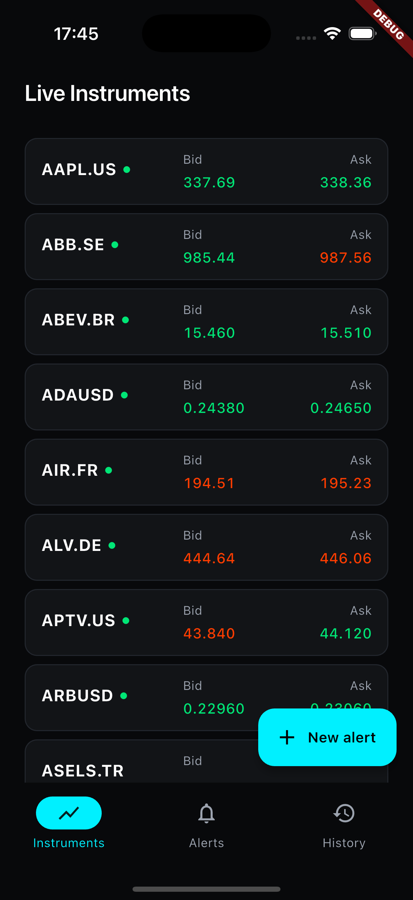
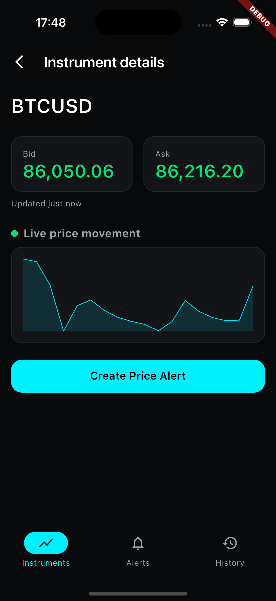
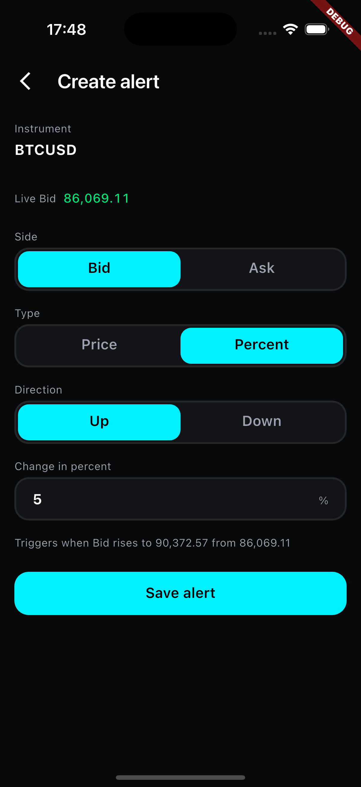
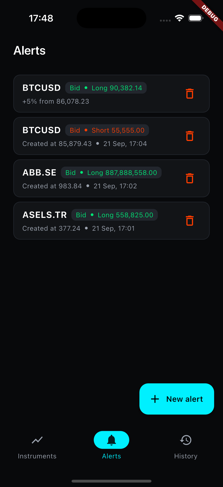
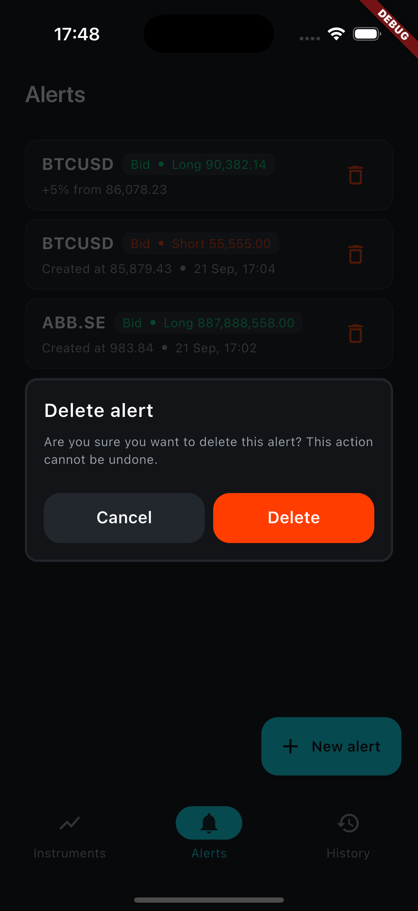
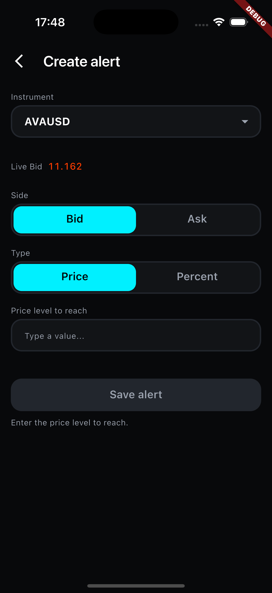
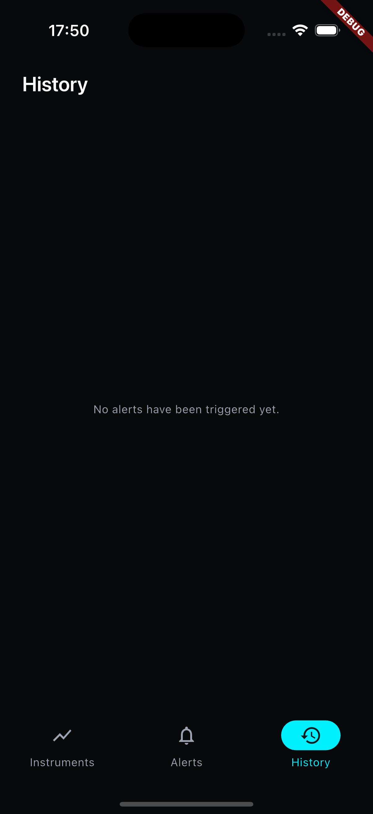

## Trading App

A Flutter mobile application created as a recruitment task.

The app displays real time market quotes for multiple instruments, supports price alerts and stores alert data locally.

Tech stack

• Flutter / Dart
• BLoC / Cubit
• GetIt
• WebSocket
• Hive
• REST API / local data source
• Clean Architecture
• Unit and widget tests
• Figma for UI design

## Screenshots

| | | |
|---|---|---|
|  |  |  |
|  |  |  |
| |  | |